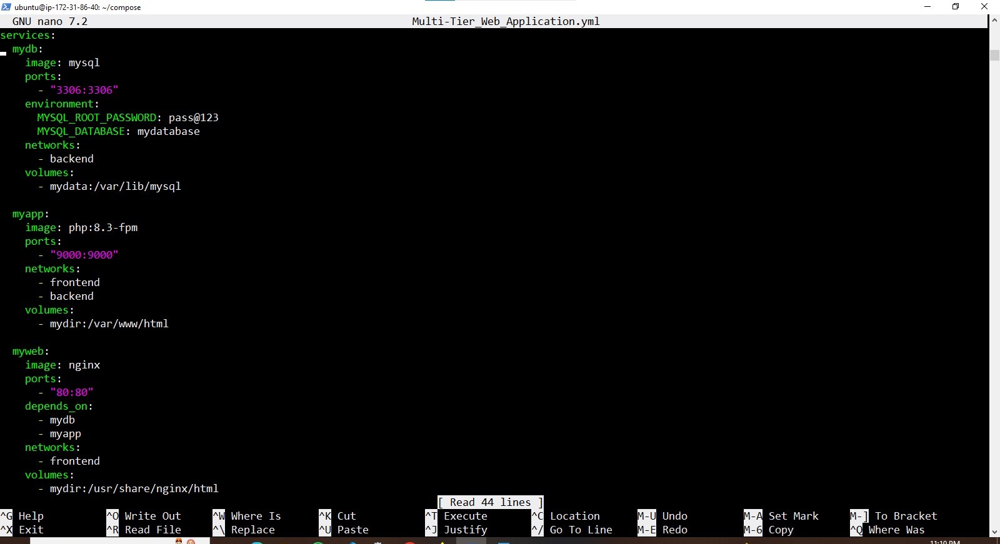
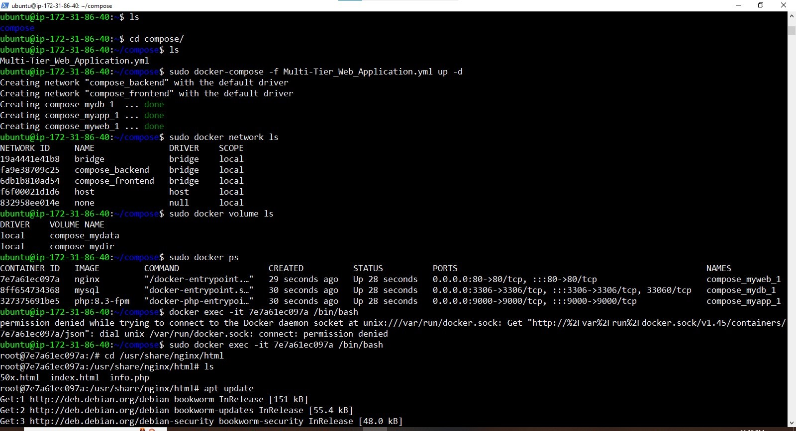
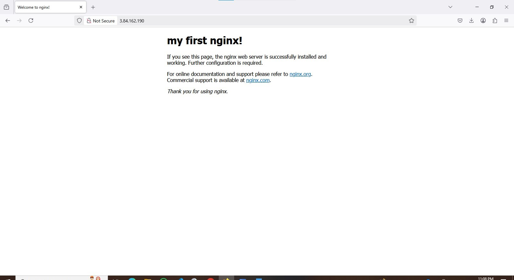
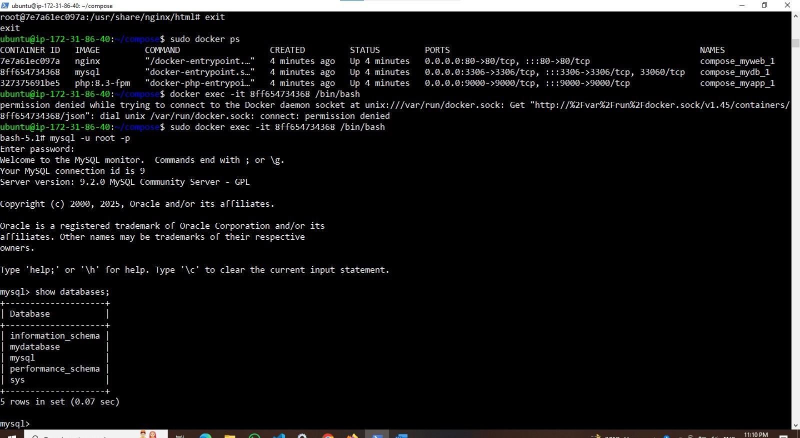

# 🚀 Multi-Tier Web Application Deployment Using Docker Compose

A production-oriented **multi-tier web application architecture** demonstrating containerized deployment with **NGINX, PHP-FPM, and MySQL** using Docker Compose.

The project focuses on practical DevOps concepts including containerization, service isolation, Docker networking, persistent storage, Linux administration, troubleshooting, and deployment on AWS EC2.

---

## 🏗️ Architecture

```text
                         Internet
                            |
                         HTTP :80
                            |
                            v
                  +-------------------+
                  |       NGINX       |
                  |      myweb        |
                  |   Web Server      |
                  +---------+---------+
                            |
                     Frontend Network
                            |
                            v
                  +-------------------+
                  |     PHP-FPM       |
                  |      myapp        |
                  |      PHP 8.3      |
                  | Application Layer |
                  +---------+---------+
                            |
                     Backend Network
                            |
                            v
                  +-------------------+
                  |       MySQL       |
                  |       mydb        |
                  |   Database Layer  |
                  +-------------------+

Docker Volumes
-----------------------------
mydir  -> Shared application files
mydata -> Persistent MySQL data
```

### Request Flow

```text
Client
  |
  v
NGINX :80
  |
  v
PHP-FPM :9000
  |
  v
MySQL :3306
```

---

## 🎯 Project Objectives

- Deploy a multi-tier web application using Docker Compose
- Containerize the web, application, and database layers
- Implement Docker network isolation using frontend and backend networks
- Use Docker volumes for persistent application and database data
- Demonstrate container-to-container communication
- Deploy and manage the application on Linux/Ubuntu
- Deploy and troubleshoot the environment on AWS EC2
- Practice essential Docker and Linux administration commands

---

## 🛠️ Technology Stack

| Technology | Purpose |
|---|---|
| Docker | Application containerization |
| Docker Compose | Multi-container orchestration |
| NGINX | Web server |
| PHP 8.3-FPM | Application runtime |
| MySQL | Relational database |
| Linux / Ubuntu | Server operating system |
| AWS EC2 | Cloud deployment |
| Git / GitHub | Version control and project hosting |

---

## 📁 Repository Structure

```text
Linux/
├── Multi-Tier_Web_Application.yml
├── README.md
└── screenshots/
    ├── docker-compose-configuration.jpg
    ├── docker-containers-running.jpg
    ├── mysql-database-verification.jpg
    └── nginx-web-server.jpg
```

---

## 🐳 Docker Services

### 1. NGINX — `myweb`

**Role:** Web server

- Exposes port `80`
- Connected to the `frontend` network
- Shares application files through the `mydir` volume
- Receives HTTP requests from clients

### 2. PHP-FPM — `myapp`

**Role:** Application runtime

- Uses PHP `8.3-FPM`
- Exposes port `9000`
- Connected to both `frontend` and `backend` networks
- Shares application files through `mydir`

### 3. MySQL — `mydb`

**Role:** Database layer

- Uses MySQL
- Connected only to the `backend` network
- Uses `mydata` for persistent database storage
- Creates the `mydatabase` database

---

## 🌐 Docker Network Architecture

The application uses two isolated Docker networks:

| Network | Connected Services | Purpose |
|---|---|---|
| `frontend` | NGINX + PHP-FPM | Web-to-application communication |
| `backend` | PHP-FPM + MySQL | Application-to-database communication |

This separation limits direct communication between the web server and database layer.

```text
                frontend network
        +-----------------------------+
        |                             |
     NGINX ---------------------- PHP-FPM
        |                             |
        +-----------------------------+
                                      |
                                backend network
                                      |
                                    MySQL
```

---

## 💾 Docker Volumes

| Volume | Mount Purpose | Persistence |
|---|---|---|
| `mydir` | Shared application files | Yes |
| `mydata` | MySQL database files | Yes |

Persistent volumes ensure that container recreation does not automatically remove application or database data.

---

## ⚙️ Docker Compose Configuration

The main Compose file is:

```text
Multi-Tier_Web_Application.yml
```

Example configuration:

```yaml
services:
  mydb:
    image: mysql
    ports:
      - "3306:3306"
    environment:
      MYSQL_ROOT_PASSWORD: ${MYSQL_ROOT_PASSWORD}
      MYSQL_DATABASE: mydatabase
    networks:
      - backend
    volumes:
      - mydata:/var/lib/mysql

  myapp:
    image: php:8.3-fpm
    ports:
      - "9000:9000"
    networks:
      - frontend
      - backend
    volumes:
      - mydir:/var/www/html

  myweb:
    image: nginx
    ports:
      - "80:80"
    depends_on:
      - mydb
      - myapp
    networks:
      - frontend
    volumes:
      - mydir:/usr/share/nginx/html

networks:
  frontend:
  backend:

volumes:
  mydata:
  mydir:
```

---

## 🔐 Environment Variables

Do not store real credentials directly in the Compose file or Git repository.

Create a local `.env` file:

```env
MYSQL_ROOT_PASSWORD=your_secure_password
```

Add `.env` to `.gitignore`:

```gitignore
.env
```

> Never commit production passwords, API keys, private keys, or other secrets to GitHub.

---

## 🚀 Deployment Guide

### Prerequisites

Install the following on the Ubuntu/AWS EC2 server:

- Docker
- Docker Compose plugin
- Git
- SSH access
- Open port `80` in the EC2 security group

Verify Docker:

```bash
docker --version
docker compose version
```

---

### Clone the Repository

```bash
git clone https://github.com/tprajwal14/dockerized-multi-tier-web-application.git
cd dockerized-multi-tier-web-application
```

> If the repository contains the project inside a `Linux/` directory, run `cd Linux` before executing the Compose commands.

---

### Configure Environment Variables

```bash
nano .env
```

Example:

```env
MYSQL_ROOT_PASSWORD=your_secure_password
```

---

### Start the Application

```bash
sudo docker compose -f Multi-Tier_Web_Application.yml up -d
```

Check running containers:

```bash
sudo docker ps
```

---

## 🔍 Verify the Deployment

### Check Container Status

```bash
sudo docker ps
```

Expected services:

```text
myweb
myapp
mydb
```

Check all containers:

```bash
sudo docker ps -a
```

---

### Check Docker Networks

```bash
sudo docker network ls
```

Inspect a network:

```bash
sudo docker network inspect <network-name>
```

---

### Check Docker Volumes

```bash
sudo docker volume ls
```

Inspect a volume:

```bash
sudo docker volume inspect <volume-name>
```

---

## 🌐 NGINX Web Server Verification

After the containers are running, open:

```text
http://YOUR_EC2_PUBLIC_IP
```

The HTTP request reaches the NGINX container on port `80`.

```text
Browser
   |
   v
EC2 Public IP :80
   |
   v
NGINX
```

---

## 🗄️ MySQL Database Verification

Connect to the MySQL container:

```bash
sudo docker exec -it <mysql-container> mysql -u root -p
```

Then verify the database:

```sql
SHOW DATABASES;
```

The expected database is:

```text
mydatabase
```

---

## 🧰 Useful Docker Commands

### Container Management

```bash
sudo docker ps
sudo docker ps -a
sudo docker start <container>
sudo docker stop <container>
sudo docker restart <container>
sudo docker rm <container>
```

### Logs

```bash
sudo docker logs <container>
sudo docker logs -f <container>
```

### Container Shell

```bash
sudo docker exec -it <container> /bin/bash
```

### Compose Management

```bash
sudo docker compose -f Multi-Tier_Web_Application.yml ps
sudo docker compose -f Multi-Tier_Web_Application.yml logs
sudo docker compose -f Multi-Tier_Web_Application.yml logs -f
sudo docker compose -f Multi-Tier_Web_Application.yml restart
sudo docker compose -f Multi-Tier_Web_Application.yml down
```

### Stop and Remove Volumes

```bash
sudo docker compose -f Multi-Tier_Web_Application.yml down -v
```

> **Warning:** `down -v` removes Docker volumes. This can permanently remove stored MySQL data. Use it only when you intentionally want to delete persistent data.

---

## 🛠️ Troubleshooting

### Check All Containers

```bash
sudo docker ps -a
```

### Check Compose Status

```bash
sudo docker compose -f Multi-Tier_Web_Application.yml ps
```

### View Application Logs

```bash
sudo docker compose -f Multi-Tier_Web_Application.yml logs
```

### Follow Logs in Real Time

```bash
sudo docker compose -f Multi-Tier_Web_Application.yml logs -f
```

### Restart the Application

```bash
sudo docker compose -f Multi-Tier_Web_Application.yml restart
```

### Check Network Connectivity

```bash
sudo docker network ls
sudo docker network inspect <network-name>
```

### Check Persistent Storage

```bash
sudo docker volume ls
sudo docker volume inspect <volume-name>
```

---

## 📸 Screenshots

### ⚙️ Docker Compose Configuration



### Docker Containers Running



### NGINX Web Server



### 🗄️ MySQL Database Verification



---

## 🔒 Security Considerations

For a production deployment, consider the following:

- Do not commit `.env` files or credentials
- Use Docker secrets or a cloud secret-management service
- Avoid exposing MySQL port `3306` publicly unless required
- Restrict AWS Security Group inbound rules
- Use HTTPS/TLS for public traffic
- Pin container image versions instead of relying on floating tags
- Add container health checks
- Use least-privilege database users
- Regularly update base images
- Scan container images for vulnerabilities
- Centralize application and container logs
- Monitor CPU, memory, disk, and application health

---

## 🔮 Future Enhancements

The project can be extended with:

- GitHub Actions CI/CD
- Jenkins CI/CD pipeline
- Docker image build and push to Amazon ECR
- AWS EC2 automated deployment
- Terraform infrastructure as code
- AWS Secrets Manager
- HTTPS with Let's Encrypt
- Prometheus and Grafana monitoring
- Centralized logging
- Container image vulnerability scanning
- Docker health checks
- Load balancing
- Kubernetes deployment
- Auto Scaling
- Infrastructure automation

---

## 💡 DevOps Skills Demonstrated

```text
Linux Administration
Docker
Docker Compose
NGINX
PHP-FPM
MySQL
Docker Networking
Docker Volumes
Container Troubleshooting
AWS EC2
Git
GitHub
Application Deployment
Production Support Concepts
```

---

## ✨ Project Highlights

- Multi-tier application architecture
- Separate frontend and backend Docker networks
- Persistent database storage
- Containerized NGINX web server
- PHP 8.3-FPM application runtime
- MySQL database container
- Linux-based deployment
- AWS EC2 deployment experience
- Practical Docker troubleshooting
- GitHub-based project documentation

---

## 👨‍💻 Author

**Prajwal Take**

AWS | DevOps | Linux | Docker | Cloud
